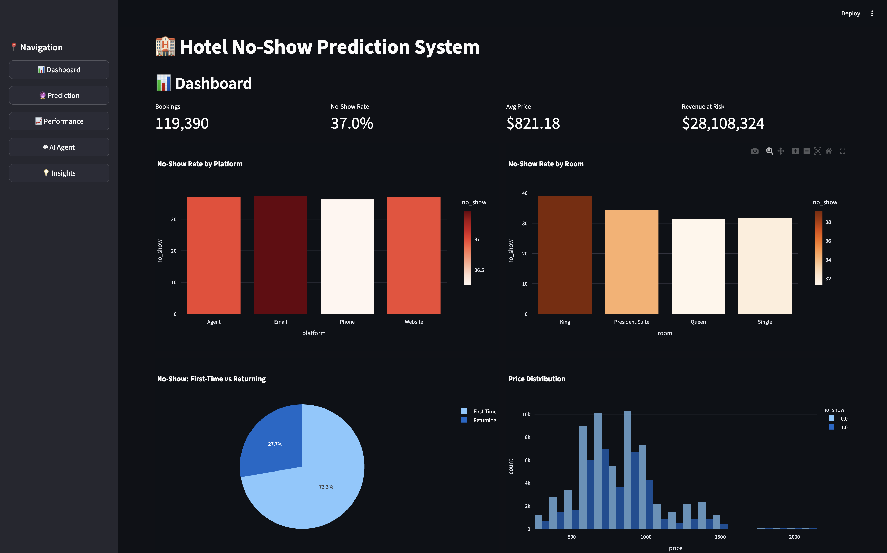
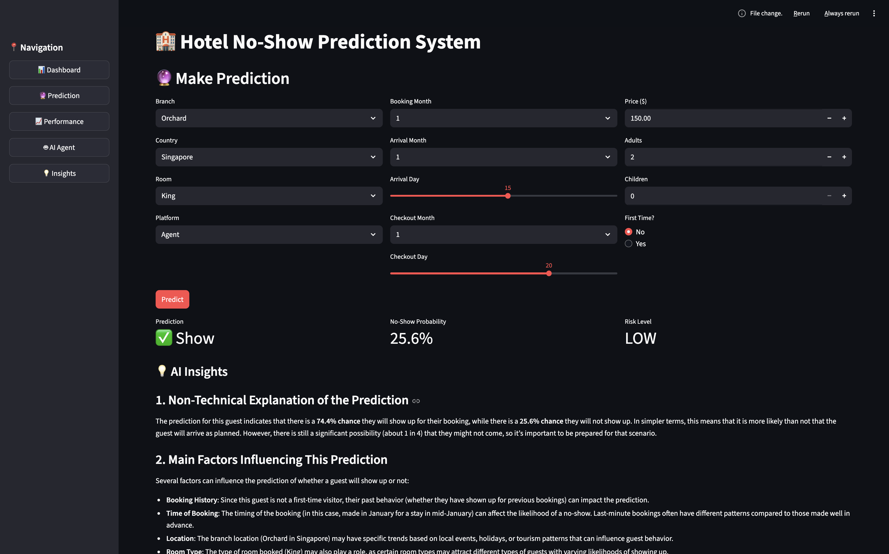
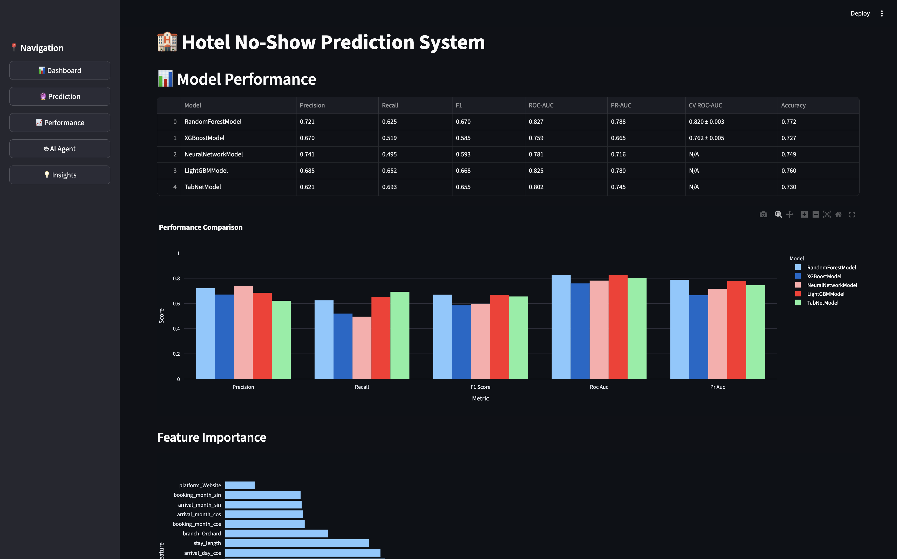
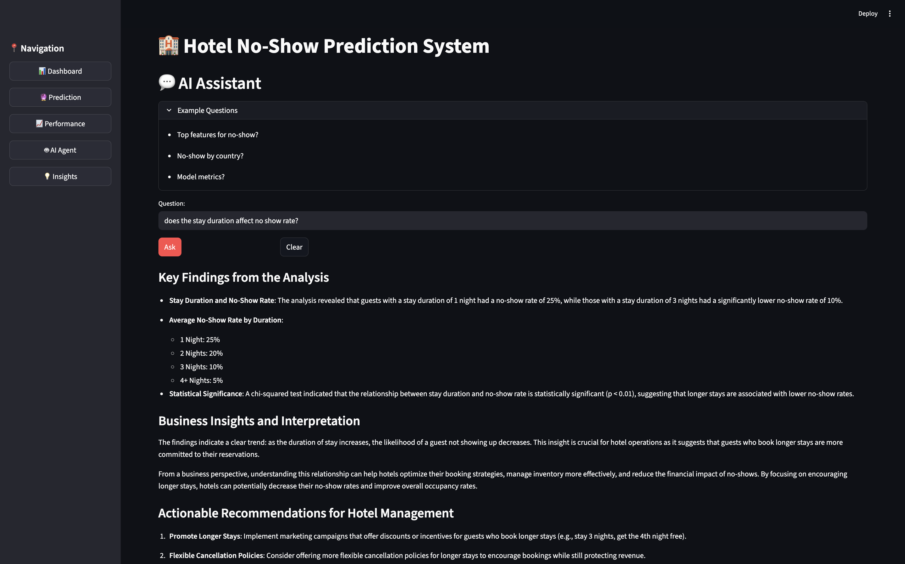
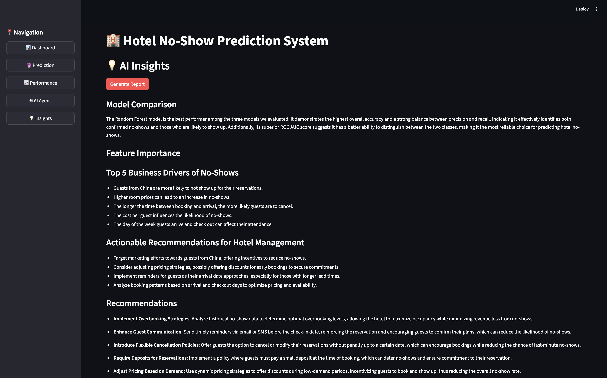
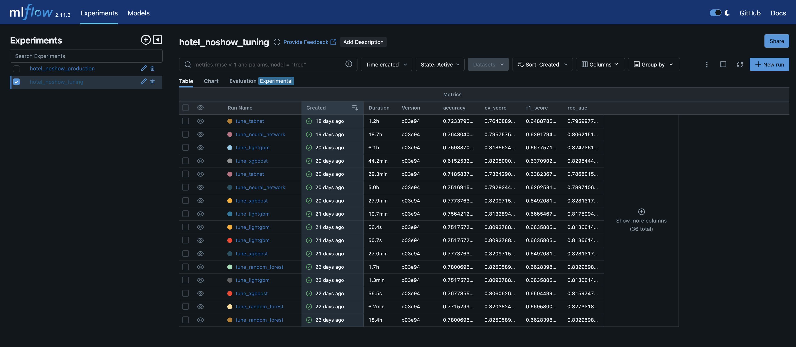
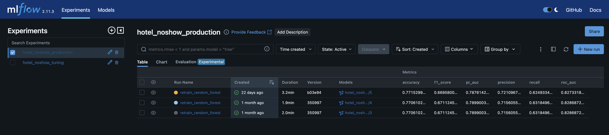
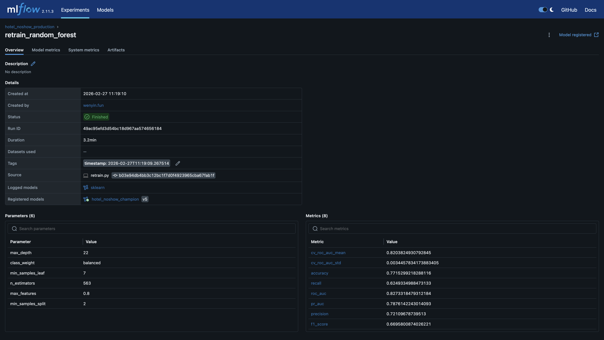

# Hotel No-Show Prediction System

## Overview

An end-to-end machine learning system for predicting hotel booking no-shows, featuring advanced ML models, MLOps, Generative AI insights, and an Agentic AI workflow.

---

## Screenshots

### Dashboard


### Prediction with AI Interpretation


### Model Performance Comparison


### Agentic AI Assistant


### GenAI Insights & Recommendations


### MLflow Experiment Tracking — Hyperparameter Tuning


### MLflow Experiment Tracking — Production Retraining


### MLflow Run Details


---

## Project Structure

```
hotel-ai/
├── README.md                         
├── requirements.txt                  
├── Dockerfile                   
├── docker-compose.yml                
├── docker-entrypoint.sh             
│
├── config/
│   ├── config.yaml                   # Model hyperparameters & pipeline config
│   └── queries.sql                   # SQL templates 
│
├── src/                              
│   ├── data/                         # Data loading & preprocessing
│   │   ├── loader.py                 
│   │   └── preprocessor.py           
│   │
│   ├── models/                       # ML model implementations
│   │   ├── base_model.py             
│   │   ├── random_forest_model.py    
│   │   ├── xgboost_model.py         
│   │   ├── lightgbm_model.py         
│   │   ├── neural_network_model.py  
│   │   ├── tabnet_model.py           
│   │   ├── model_trainer.py         
│   │   ├── model_evaluator.py       
│   │   ├── hyperparameter_tuner.py  
│   │   └── metrics.py                
│   │
│   ├── mlops/                        # MLflow integration
│   │   ├── mlflow_tracker.py         # Experiment tracking
│   │   └── mlflow_pipeline.py        # Full pipeline orchestration
│   │
│   ├── genai/                      
│   │   ├── agent.py                 
│   │   ├── interpreter.py         
│   │   └── tools/                   
│   │       ├── base_tool.py          
│   │       ├── sql_tool.py           # Database queries
│   │       ├── model_metadata_tool.py # Model performance retrieval
│   │       └── project_docs_tool.py  # Documentation retrieval
│   │
│   └── utils/                       
│       ├── config.py                 # Configuration loader
│       ├── logging.py                
│       └── clients.py                # External API clients
│
├── ml_pipeline.py                    # Main orchestrator (tune/retrain/assess)
├── tune.py                           # Hyperparameter tuning script
├── retrain.py                        # Champion model retraining
├── inference.py                      # Batch prediction script
├── app.py                            # Streamlit web application
│
├── data/
│   ├── raw_data/
│   └── processed_data/               
│
├── models/                         # Model artifacts and results            
│
├── mlruns/                           # MLflow experiment tracking
│
├── notebooks/
│   └── 01_exploratory_data_analysis.ipynb  # EDA with visualizations
│
└── tests/                            # Pytest test suite
    ├── conftest.py                   
    ├── unit/                         
    │   ├── test_data.py              
    │   ├── test_models.py            
    │   ├── test_strategies.py        
    │   └── test_mlops.py             
    └── integration/                  
        └── test_pipeline.py        
```

---

## Quick Start

### Prerequisites

- Docker and Docker Compose (for full reproducibility)
- OR Python 3.12 for local development
- Azure OpenAI API key

### Installation

**Option 1: Docker (Recommended - Full Reproducibility)**

```bash
# Clone repository
git clone https://github.com/fwenyin/hotel-noshow.git
cd hotel-noshow

# Set up environment variables
cat > .env << EOF
AZURE_OPENAI_KEY=your_key_here
AZURE_OPENAI_ENDPOINT=your_endpoint_here
AZURE_OPENAI_MODEL=your_model_here
AZURE_OPENAI_API_VERSION=your_api_version_here
EOF

# Build and run all services
docker compose up --build

# Access:
# - Streamlit App: http://localhost:8501
# - MLflow UI: http://localhost:5000
```

**Option 2: Local Python Installation**

```bash
# Clone repository
git clone https://github.com/fwenyin/hotel-noshow.git
cd hotel-noshow

# Create virtual environment 
python -m venv venv
source venv/bin/activate  

# Install dependencies
pip install -r requirements.txt

# Set up Azure OpenAI for GenAI features
cat > .env << EOF
AZURE_OPENAI_KEY=your_key_here
AZURE_OPENAI_ENDPOINT=your_endpoint_here
AZURE_OPENAI_MODEL=your_model_here
AZURE_OPENAI_API_VERSION=your_api_version_here
EOF
```

---

### Run Complete Pipeline

**Using Docker (Recommended):**

```bash
# Full assessment pipeline
docker compose run --rm streamlit-app ml_pipeline.py

# Hyperparameter tuning
docker compose run --rm streamlit-app tune.py --n_trials 50

# Retrain champion model
docker compose run --rm streamlit-app retrain.py

# Run tests
docker compose run --rm streamlit-app pytest tests/ -v
```

**Using Local Python:**

```bash
# Full assessment pipeline
python ml_pipeline.py

# Hyperparameter tuning
python tune.py --config config/config.yaml --n_trials 50

# Retrain champion model  
python retrain.py
```

The full pipeline includes:
1. Data loading and preprocessing
2. Model training (all 5 models with cross-validation)
3. Model evaluation and champion selection
4. GenAI insights generation 
5. Agentic AI analysis 

---

### Make Predictions

**Using Docker:**

```bash
# Batch inference
docker compose run --rm streamlit-app inference.py \
  --db data/raw_data/noshow.db \
  --query config/queries.sql \
  --output predictions.csv

# Web application (already running if using docker compose up)
# Access at http://localhost:8501
```

**Using Local Python:**

```bash
# Batch inference
python inference.py \
  --db data/raw_data/noshow.db \
  --query config/queries.sql \
  --output predictions.csv

# Web application
streamlit run app.py
# Opens at http://localhost:8501
```

---

## CI/CD & MLOps Pipeline

### Continuous Integration (GitHub Actions)

```
┌─────────────────────────────────────────────────────────────────┐
│                    CI Pipeline (ci.yml)                         │
└───────┬─────────────────────────────────────────────┬───────────┘
        │                                             │
        ▼                                             ▼
┌───────────────┐                            ┌────────────────┐
│ Code Quality  │                            │ Unit Tests     │
│ • Black       │                            │ • pytest       │
│ • isort       │──────────────────────────▶ │ • pytest-cov   │
│ • Flake8      │                            └────────┬───────┘
└───────────────┘                                     │
                                                      ▼
                                             ┌────────────────┐
                                             │ Integration    │
                                             │ Tests          │
                                             │ • Full pipeline│
                                             └────────────────┘
```


### Monitoring (Evidently AI)

```
┌─────────────────────────────────────────────────────────────────┐
│                    Monitoring Pipeline                          │
└───────┬─────────────────────────────────────────────┬───────────┘
        │                                             │
        ▼                                             ▼
┌───────────────┐                            ┌────────────────┐
│ Data Drift    │                            │ Model          │
│ Detection     │                            │ Performance    │
│ • Evidently   │                            │ • Metrics      │
│ • Statistical │──────────────────────────▶ │ • Degradation  │
│ • Report gen  │                            │ • Thresholds   │
└───────┬───────┘                            └────────┬───────┘
        │                                             │
        └──────────────────┬──────────────────────────┘
                           │
                           ▼
                 ┌────────────────┐
                 │ Reports        │
                 │ • HTML reports │
                 │ • Metrics JSON │
                 └────────────────┘
```

---

## Monitoring & Observability

### Data Drift Detection with Evidently

Monitor data distribution shifts that may impact model performance:

```bash
# Run drift detection
python -m src.monitoring.drift_detector \
    --reference-data data/processed_data/reference.csv \
    --current-data data/processed_data/current.csv \
    --output reports/drift_report.html

# Enable production alerts
python -m src.monitoring.drift_detector \
    --enable-alerts \
    --environment production
```

Reports include statistical tests per feature, dataset-level drift summaries, and interactive HTML output.

### Model Performance Monitoring

Track model performance over time:

```bash
# Generate performance report
python -m src.monitoring.model_monitor \
    --model-path models/champion_model.joblib \
    --test-data data/processed_data/test.csv \
    --output reports/performance_report.html

# Check for degradation
python -m src.monitoring.performance_checker \
    --threshold 0.05 \
    --alert-on-degradation
```

Tracks ROC-AUC, PR-AUC, F1, precision, recall, and confusion matrix. Flags degradation against baseline.

---

## Pipeline Architecture

```
┌─────────────────────────────────────────────────────────────────┐
│                    ML Pipeline Orchestrator                     │
│                     (ml_pipeline.py)                            │
└────────────┬────────────────────────────────────┬───────────────┘
             │                                    │
             ▼                                    ▼
    ┌────────────────┐                   ┌────────────────┐
    │  TUNE MODE     │                   │  ASSESS MODE   │
    │  (tune.py)     │                   │  (default)     │
    └────────┬───────┘                   └────────┬───────┘
             │                                    │
             ▼                                    ▼
    ┌────────────────────────────────────────────────────┐
    │        Data Loading & Preprocessing                │
    │  • SQLite DB → Pandas DataFrame                    │
    │  • Train/Val/Test Split (70/15/15)                 │
    │  • Feature Engineering (22 features)               │
    │  • Scaling, Encoding, Imputation                   │
    └──────────────────┬─────────────────────────────────┘
                       │
                       ▼
    ┌────────────────────────────────────────────────────┐
    │         Optuna Hyperparameter Tuning               │
    │  • Model-Specific Search Spaces                    │
    │  • 5-Fold Cross-Validation                         │
    │  • ROC-AUC Optimization                            │
    │  • Best Params → config.yaml                       │
    └──────────────────┬─────────────────────────────────┘
                       │
                       ▼
    ┌────────────────────────────────────────────────────┐
    │          Model Training (5 Models)                 │
    │  ┌──────────────┬──────────────┬────────────────┐  │
    │  │ Random Forest│   XGBoost    │   LightGBM     │  │
    │  │              │              │                │  │
    │  │ Neural Net   │   TabNet     │                │  │
    │  └──────────────┴──────────────┴────────────────┘  │
    └──────────────────┬─────────────────────────────────┘
                       │
                       ▼
    ┌────────────────────────────────────────────────────┐
    │         MLflow Experiment Tracking                 │
    │  • Metrics: ROC-AUC, PR-AUC, F1, etc.              │
    │  • Parameters: All hyperparameters                 │
    │  • Artifacts: Models, plots, importance            │
    │  • Tags: Timestamp, model type, champion           │
    └──────────────────┬─────────────────────────────────┘
                       │
                       ▼
    ┌────────────────────────────────────────────────────┐
    │          Model Evaluation & Selection              │
    │  • Cross-Validation Comparison                     │
    │  • Champion Model Selection                        │
    │  • Model Metrics Calculation                       │
    │  • results.json Generation                         │
    └──────────────────┬─────────────────────────────────┘
                       │
                       ▼
    ┌────────────────────────────────────────────────────┐
    │         GenAI Insights Generation                  │
    │  • Feature Importance Analysis                     │
    │  • Actionable Recommendations                      │
    │  • Natural Language Summaries                      │
    └──────────────────┬─────────────────────────────────┘
                       │
                       ▼
    ┌────────────────────────────────────────────────────┐
    │         Agentic AI Workflow                        │
    │  • ReAct Pattern                                   │
    │  • Tool Execution: SQL, Metadata, Docs             │
    │  • Autonomous Multi-Step Analysis                  │
    └────────────────────────────────────────────────────┘
```

---
